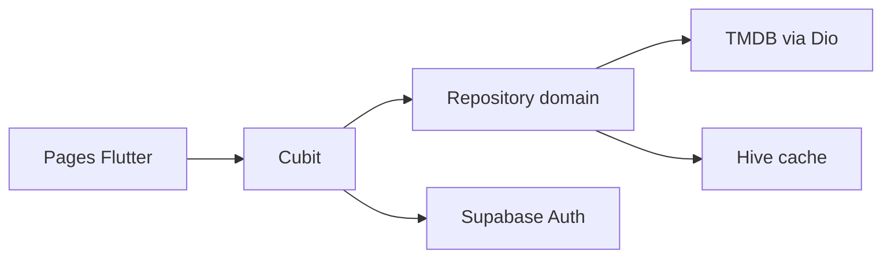

# CineHub — Flutter Full-Stack Certification Project

Application Flutter de démonstration couvrant authentification, API REST, architecture Clean, persistance locale et mode hors-ligne.

## Stack

- Flutter / Dart
- Supabase Auth : login, register, logout et sessions JWT
- TMDB REST API : films réels
- Dio : HTTP client + interceptor
- Hive : cache local
- BLoC/Cubit : gestion d'état
- Clean Architecture : data / domain / presentation
- Mocktail : tests unitaires

## Configuration

Créer un projet Supabase et récupérer l'URL et la clé anon.

Créer une clé API TMDB depuis le compte développeur TMDB.

Lancer :

```bash
flutter pub get
flutter run --dart-define=TMDB_API_KEY=VOTRE_CLE_TMDB --dart-define=SUPABASE_URL=VOTRE_URL --dart-define=SUPABASE_ANON_KEY=VOTRE_CLE
```

Sans Supabase configuré, l'application démarre en mode démo et le module de films reste utilisable. Lorsque Supabase est configuré, l'accès aux films est protégé par l'authentification.

Supabase renouvelle automatiquement la session JWT lorsqu'elle arrive à expiration. L'intercepteur Dio réutilise le jeton courant pour les appels authentifiés.

## Fonctionnalités

1. Authentification Supabase
2. Injection du token via interceptor Dio
3. Films populaires
4. Films les mieux notés
5. Films actuellement à l'affiche
6. Page de détails
7. Cache Hive
8. Fallback automatique vers le cache en cas d'erreur réseau
9. Messages utilisateur
10. Trois tests unitaires du repository

## Architecture

```text
features/
  auth/
    data/
    domain/
    presentation/
  movies/
    data/
    domain/
    presentation/

core/
  constants/
  error/
  network/
  storage/
```

Le repository orchestre les sources distante et locale. La couche domain ne dépend ni de Dio ni de Hive.



## Tests

```bash
flutter test
```

## GitHub

Après validation locale :

```bash
git init
git add .
git commit -m "feat: initial CineHub certification project"
git branch -M main
git remote add origin https://github.com/VOTRE_COMPTE/cinehub.git
git push -u origin main
```

## Remarque API

TMDB est une API tierce. Respectez ses conditions d'utilisation et ajoutez les crédits/attributions requis avant publication commerciale.
